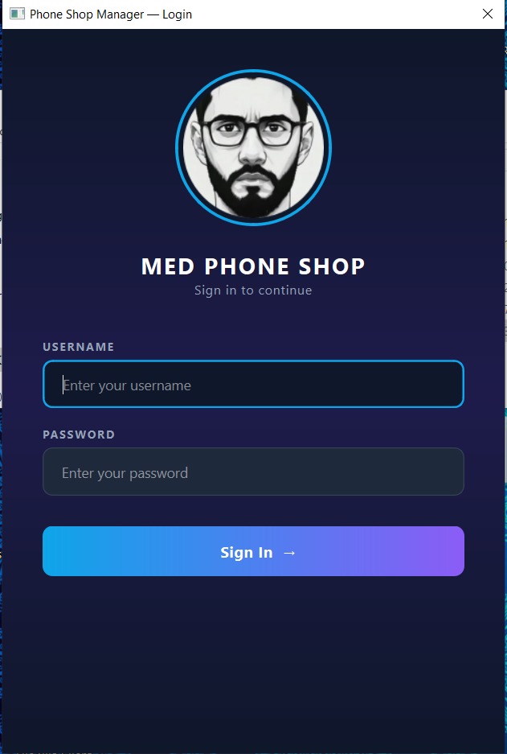
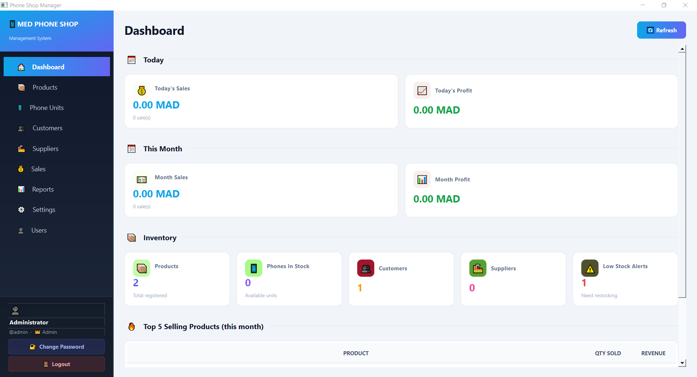
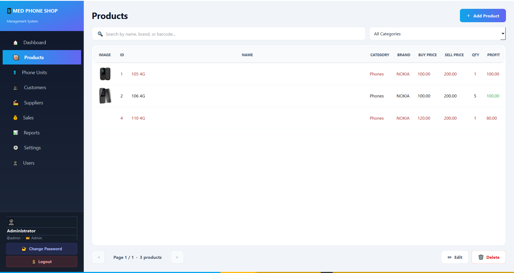
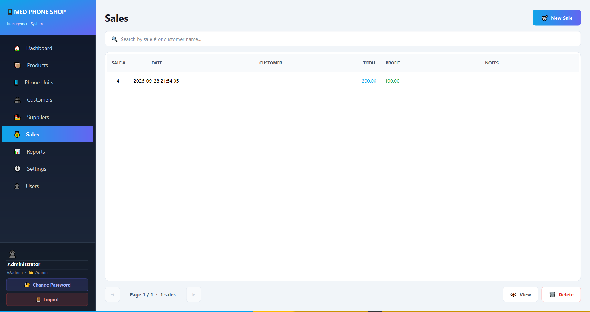
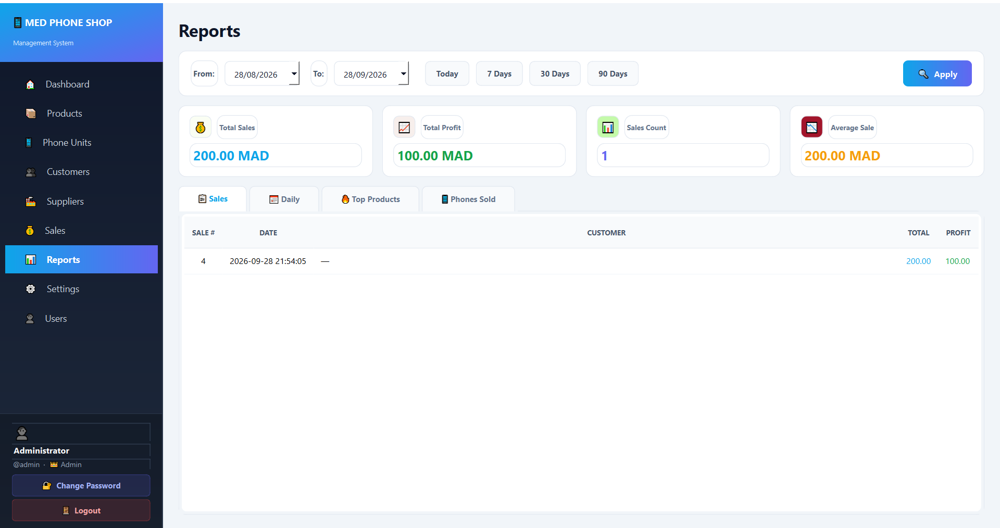
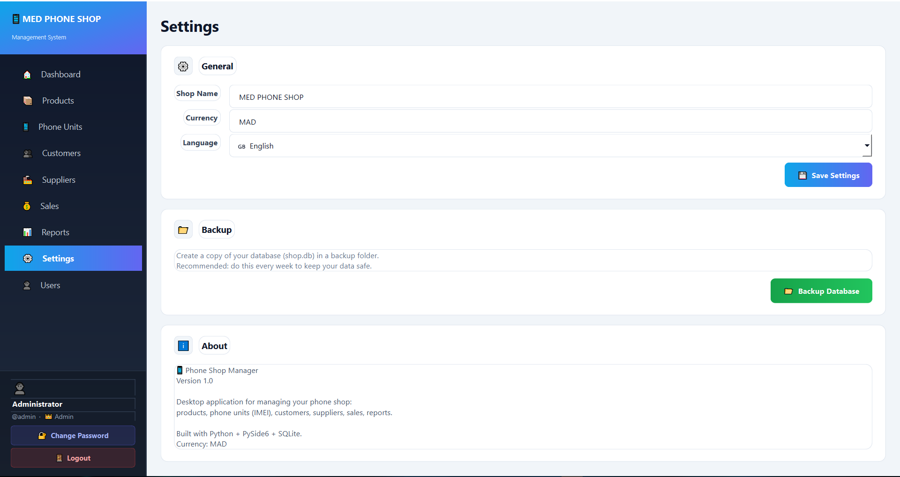

# 📱 Phone Shop Manager

A modern, professional desktop application for managing a phone shop.



## ✨ Features

- 🔐 **Secure Login** with role-based access (Admin / Cashier)
- 📦 **Products Management** with images, categories, and stock alerts
- 📱 **Phone Units Tracking** with IMEI
- 👥 **Customers & Suppliers** management
- 💰 **Sales System** with cart (products + phone units)
- 📊 **Dashboard** with real-time statistics
- 📈 **Reports** with date range filters
- 🌍 **Multi-language** (English / Français / العربية)
- 💰 **Multi-currency** (MAD / DH / درهم)
- 💾 **Database Backup** system

## 📸 Screenshots

### 🏠 Dashboard


### 📦 Products Management


### 💰 Sales System


### 📊 Reports


### ⚙️ Settings


## 🛠️ Tech Stack

- **Python 3.14**
- **PySide6** (Qt for Python)
- **SQLite** (local database)
- **PyInstaller** (packaging)

## 🚀 Installation

### From source
```bash
pip install -r requirements.txt
python main.py