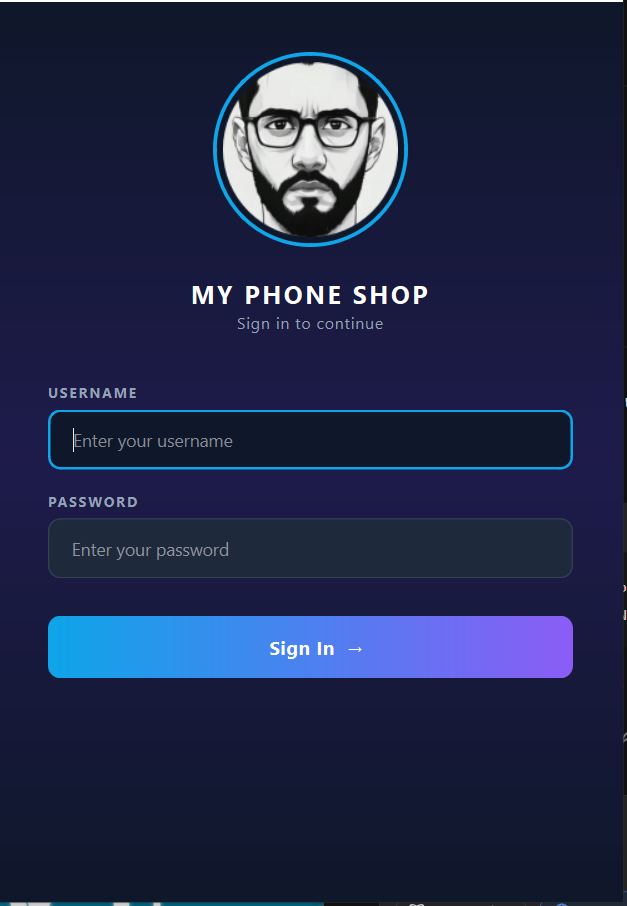
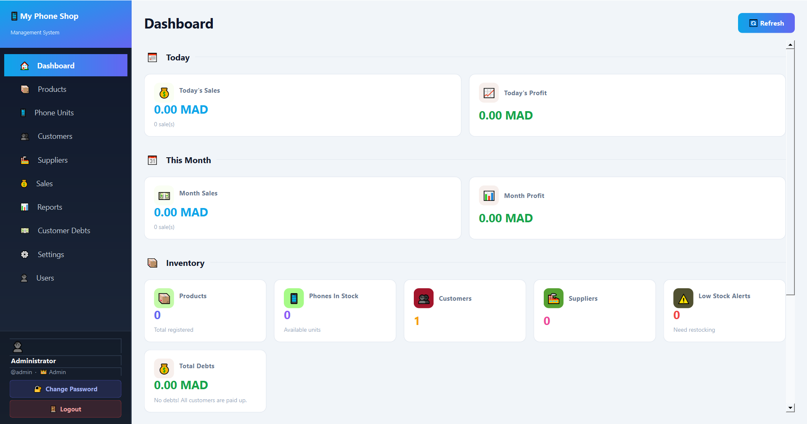
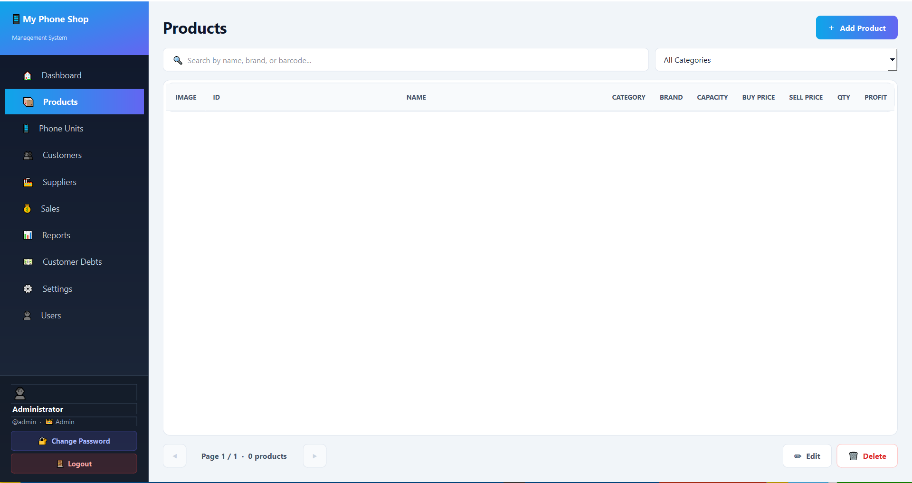
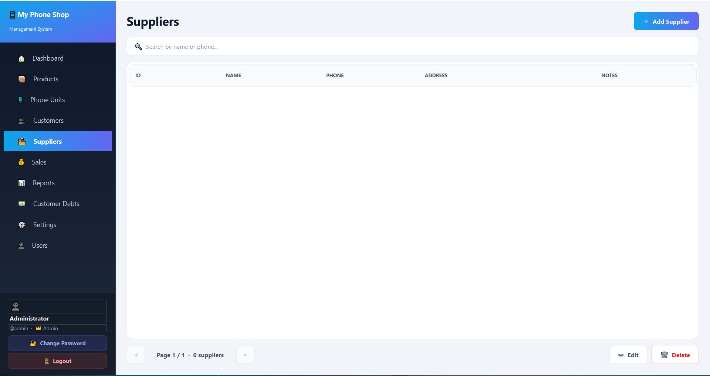
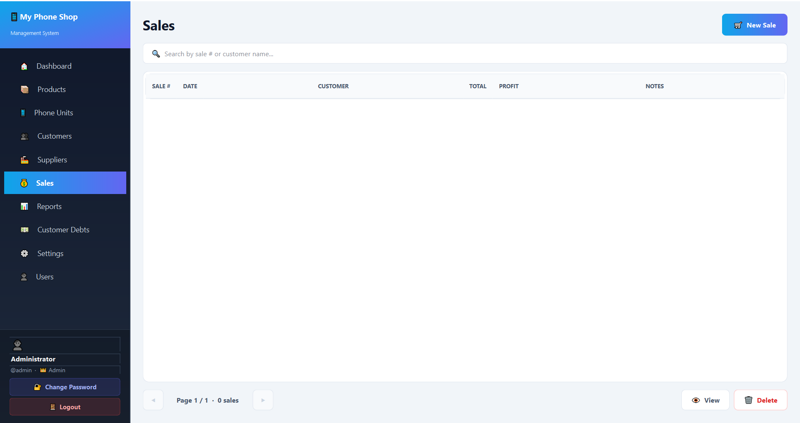
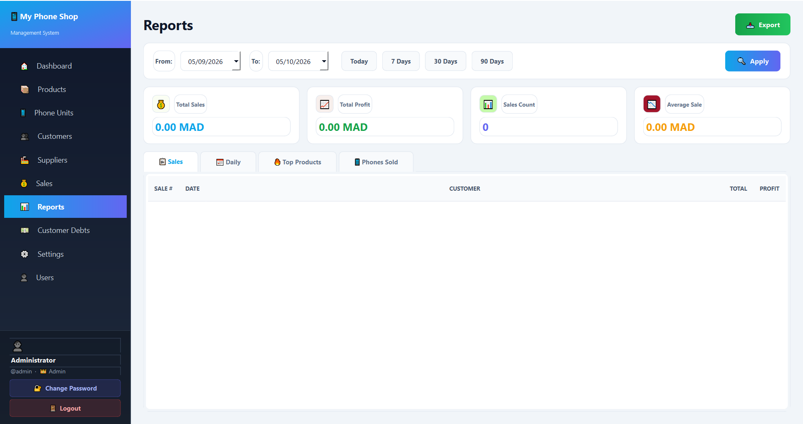

# 📱 MK-PHONE-ACCESSORIES

A modern, professional desktop application for managing a phone shop.



## ✨ Features

### 🏪 Shop Management
- 📦 **Products** with images, categories, and capacity (64GB, 20000mAh...)
- 📱 **Phone Units** with unique IMEI tracking
- 👥 **Customers** & **Suppliers** management
- 📋 **34 product categories** (HDD, SSD, USB, SD Card, Power Bank, Gaming...)

### 💰 Sales & Debts
- 🛒 **Sales system** with cart (products + phones)
- 💳 **Customer debts tracking** with partial payments
- 📜 **Payment history** per customer
- 🧾 **PDF receipts** — auto-generated after each sale + reprint from history

### 📊 Analytics
- 🏠 **Dashboard** with daily/monthly stats
- 📈 **Reports** with date range filters
- 📥 **Export to Excel/CSV** — sales, products, customers, debts

### 🌍 Multi-language & Roles
- 🌍 **3 languages** — English / Français / العربية
- 💰 **Multi-currency** — MAD / DH / درهم
- 🔐 **Role-based access** — Admin / Cashier
- 🔑 **Change password** dialog

## 📸 Screenshots

### 🏠 Dashboard


### 📦 Products Management


### 📱 Phone Units (IMEI)
.png)

### 👥 Customers & Suppliers


### 💰 Sales System


### 💳 Customer Debts Tracking


### 📊 Reports & Export


## 🛠️ Tech Stack

- **Python 3.14**
- **PySide6** (Qt for Python)
- **SQLite** (local database)
- **fpdf2** (PDF receipts)
- **PyInstaller** (packaging)

## 🚀 Installation

### From source
```bash
pip install -r requirements.txt
python main.py